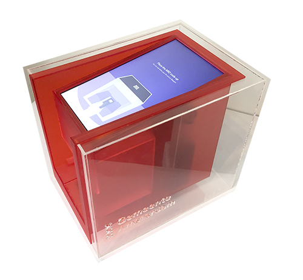
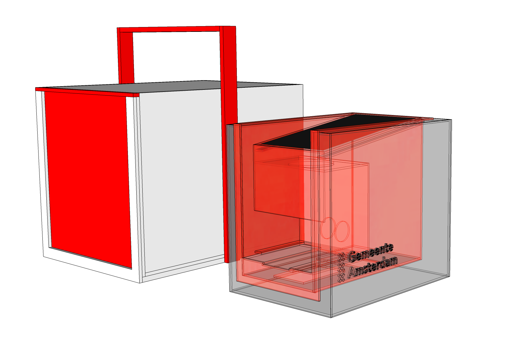

# Decode Passport Scanner

This Passport Scanner is part of the Decode Amsterdam project. For more extended information check out the [Decode Amsterdam](https://github.com/Amsterdam/decode_amsterdam_pwa) repository.



In this repository you will everything you need to create your own Passport Scanner. It could be used stand alone to read data of the NFC chip inside a passport, but it's full potential is to read the data and then make it available from transfer to the Decode Amsterdam PWA.

**Important note:**
This project was created as a proof of concept prototype. There for it was never meant to be used on a large scale but for demonstration purposes only.

In this repository you will find the following:

* Code for communication with different hardware elements
* Code for communication with the [Decode Session Manager](https://github.com/Amsterdam/decode_session_manager)
* Documentation for building a physical box to combine all hardware elements 

The code and hardware has only been tested using Ubuntu 18.04.


## Hardware

There are different hardware elements needed to get the party started.

### NFC Reader

Before we start it is good to mention there is a specific library being used to handle all the complicated interaction between a NFC scanner and the NFC chip in a passport. This library, PyPassport, needed to be modified slightly in order to work with the NFC readers we had available. This modified version can be found as a submodule of this project and [here](https://github.com/sguldemond/pypassport). The library it self is using the standard of Machine Readable Travel Documents (MRTD) as defined in [ICAO Doc 9303](https://www.icao.int/publications/pages/publication.aspx?docnum=9303). 

The NFC reader we ended up using is the [ACS ACR1252U-M1](https://www.acs.com.hk/en/products/342/acr1252u-usb-nfc-reader-iii-nfc-forum-certified-reader/), supported by the [CCID driver](https://ccid.apdu.fr/).

#### Testing the NFC Reader

List all USB devices: `$ lsusb`

Using the [PCSC-lite](https://pcsclite.apdu.fr/) daemon `pcscd` you can check if the driver is compatible with a NFC scanner:
`$ sudo pcscd -f -d`

Start PCSC in the background:
`$ service pcscd start`

Using [pcsc-tools](http://ludovic.rousseau.free.fr/softwares/pcsc-tools/) chips on the scanner can be read, PCSC needs te be started for this:
`$ pcsc_scan`


### Camera

The camera is used to read the MRZ (Machine Readable Zone) on a passport which on its turn it used to decrypt the data on the passport's NFC chip.

Any modern webcam will do, as long as it has a decent resolution to perform OCR. We ended up using the [Razer Kiyo](https://www.razer.com/gaming-broadcaster/razer-kiyo). We modified it by removing the stand so only the camera was left, this way it fit nicely in the box.


### The Box

The box combines all the hardware in to one physical element. For our setup we used three more elements to complete the setup:
* PC, Intel NUC i5 with BX500 120GB SSD & Crucial 4GB DDR RAM
* Monitor, [Seeed 10.1 inch LCD display](https://www.seeedstudio.com/10-1-Inch-LCD-Display-1366x768-HDMI-VGA-NTSC-PAL-p-1586.html)
* Keyboard, [Logitech K400 Wireless Touch](https://www.logitech.com/en-us/product/wireless-touch-keyboard-k400r)

In the folder `the_box` you can a Sketch Up file of this render:



All the AutoCAD files (`.dxf`) to laser cut the different pieces are also available there.


## Setup

Install virtualenv:
```
$ pip install virtualenv
```

Find your local python executable:
```
$ python -c "import sys; print sys.executable"
```

Setup new virtualenv using this location:
```
$ virtualenv --python=/usr/bin/python venv
```

Then activate it:
```
$ source venv/bin/activate
```

Install the requirements:
```
(venv) $ pip install -r requirements.txt
```

Now you can install the modified version of PyPassport:
```
$ git clone https://github.com/landgenoot/pypassport-2.0
$ cd pypassport-2.0
(venv) $ pip install .
```

Create config file:
```
```

Setup Session Manager API:
```
```


## Run


```
$ python frontend.py
```

This should start connecting the de Session Manager and eventually show the first screen.


## Appendix

### ICAO Doc 9303

The standard around Machine Readable Travel Documents can be found at [here](https://www.icao.int/publications/pages/publication.aspx?docnum=9303)


### ePassportViewer
- [Origin](https://github.com/andrew867/epassportviewer)
- [GitHub mirror](https://github.com/andrew867/epassportviewer)

It is supported by the PyPassport python library, which can be found in the same repository.

These projects have been actively investigated. It takes some time to get all the needed software installed since main project was last updated 4 years ago. But the viewer and pypassport library are working.
We got stuck at reading the passport information.
